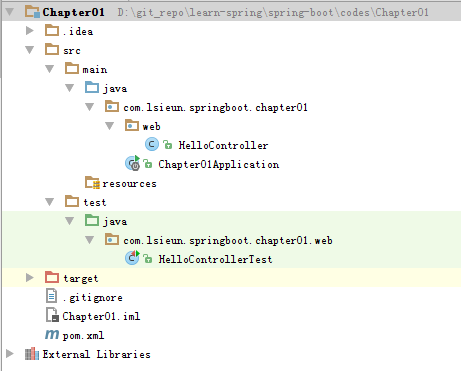
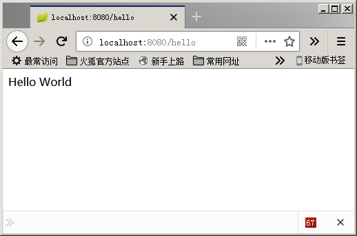

# Spring Boot快速入门 #

[Spring Boot基础教程](http://blog.didispace.com/Spring-Boot%E5%9F%BA%E7%A1%80%E6%95%99%E7%A8%8B/)
[Spring Boot快速入门](http://blog.didispace.com/spring-boot-learning-1/)
[Spring Boot](http://blog.didispace.com/categories/Spring-Boot/)
[程序猿DD / SpringBoot-Learning](https://gitee.com/didispace/SpringBoot-Learning)

JDK: Java 1.8.0_102



## 1、pom.xml ##

```xml
<?xml version="1.0" encoding="UTF-8"?>
<project xmlns="http://maven.apache.org/POM/4.0.0"
         xmlns:xsi="http://www.w3.org/2001/XMLSchema-instance"
         xsi:schemaLocation="http://maven.apache.org/POM/4.0.0 http://maven.apache.org/xsd/maven-4.0.0.xsd">
    <modelVersion>4.0.0</modelVersion>

    <groupId>com.lsieun.learn.springboot</groupId>
    <artifactId>Chapter01</artifactId>
    <version>1.0-SNAPSHOT</version>
    <packaging>jar</packaging>

    <name>Chapter01</name>
    <description>Demo project for Spring Boot</description>

    <parent>
        <groupId>org.springframework.boot</groupId>
        <artifactId>spring-boot-starter-parent</artifactId>
        <version>1.4.7.RELEASE</version>
        <relativePath/> <!-- lookup parent from repository -->
    </parent>

    <properties>
        <project.build.sourceEncoding>UTF-8</project.build.sourceEncoding>
        <project.reporting.outputEncoding>UTF-8</project.reporting.outputEncoding>
        <java.version>1.8</java.version>
    </properties>

    <dependencies>
        <dependency>
            <groupId>org.springframework.boot</groupId>
            <artifactId>spring-boot-starter</artifactId>
        </dependency>

        <dependency>
            <groupId>org.springframework.boot</groupId>
            <artifactId>spring-boot-starter-test</artifactId>
            <scope>test</scope>
        </dependency>

        <dependency>
            <groupId>org.springframework.boot</groupId>
            <artifactId>spring-boot-starter-web</artifactId>
        </dependency>
    </dependencies>

    <build>
        <plugins>
            <plugin>
                <groupId>org.springframework.boot</groupId>
                <artifactId>spring-boot-maven-plugin</artifactId>
            </plugin>
        </plugins>
    </build>

</project>
```

## 2、添加Application类 ##

```java
package com.lsieun.springboot.chapter01;

import org.springframework.boot.SpringApplication;
import org.springframework.boot.autoconfigure.SpringBootApplication;

@SpringBootApplication
public class Chapter01Application {
    public static void main(String[] args) {
        SpringApplication.run(Chapter01Application.class, args);
    }
}
```


## 3、添加HelloController ##

```java
package com.lsieun.springboot.chapter01.web;

import org.springframework.web.bind.annotation.RequestMapping;
import org.springframework.web.bind.annotation.RestController;

@RestController
public class HelloController {

    @RequestMapping("/hello")
    public String index() {
        return "Hello World";
    }

}
```

## 4、使用浏览器查看 ##

访问地址：

	http://localhost:8080/hello



## 5、编写单元测试HelloControllerTest ##

```java
package com.lsieun.springboot.chapter01.web;

import static org.hamcrest.Matchers.equalTo;
import static org.springframework.test.web.servlet.result.MockMvcResultMatchers.content;
import static org.springframework.test.web.servlet.result.MockMvcResultMatchers.status;

import org.junit.Before;
import org.junit.Test;
import org.junit.runner.RunWith;
import org.springframework.boot.test.context.SpringBootTest;
import org.springframework.http.MediaType;
import org.springframework.test.context.junit4.SpringJUnit4ClassRunner;
import org.springframework.test.context.web.WebAppConfiguration;
import org.springframework.test.web.servlet.MockMvc;
import org.springframework.test.web.servlet.request.MockMvcRequestBuilders;
import org.springframework.test.web.servlet.setup.MockMvcBuilders;


@RunWith(SpringJUnit4ClassRunner.class)
@SpringBootTest
@WebAppConfiguration
public class HelloControllerTest {
    private MockMvc mvc;

    @Before
    public void setUp() throws Exception {
        mvc = MockMvcBuilders.standaloneSetup(new HelloController()).build();
    }

    @Test
    public void getHello() throws Exception {
        mvc.perform(MockMvcRequestBuilders.get("/hello").accept(MediaType.APPLICATION_JSON))
                .andExpect(status().isOk())
                .andExpect(content().string(equalTo("Hello World")));
    }
}
```


