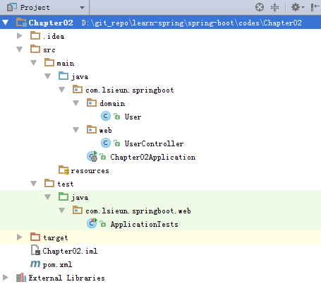

# Spring Boot构建RESTful API与单元测试 #

[Spring Boot构建RESTful API与单元测试](http://blog.didispace.com/springbootrestfulapi/)
[Spring Boot](http://blog.didispace.com/categories/Spring-Boot/)
[程序猿DD / SpringBoot-Learning](https://gitee.com/didispace/SpringBoot-Learning)

JDK: Java 1.8.0_102



## 1、pom.xml ##

```xml
<?xml version="1.0" encoding="UTF-8"?>
<project xmlns="http://maven.apache.org/POM/4.0.0"
         xmlns:xsi="http://www.w3.org/2001/XMLSchema-instance"
         xsi:schemaLocation="http://maven.apache.org/POM/4.0.0 http://maven.apache.org/xsd/maven-4.0.0.xsd">
    <modelVersion>4.0.0</modelVersion>

    <groupId>com.lsieun.springboot</groupId>
    <artifactId>Chapter02</artifactId>
    <version>1.0-SNAPSHOT</version>
    <packaging>jar</packaging>

    <name>Chapter02</name>
    <description>Demo project for Spring Boot</description>

    <parent>
        <groupId>org.springframework.boot</groupId>
        <artifactId>spring-boot-starter-parent</artifactId>
        <version>1.4.7.RELEASE</version>
        <relativePath/> <!-- lookup parent from repository -->
    </parent>

    <properties>
        <project.build.sourceEncoding>UTF-8</project.build.sourceEncoding>
        <project.reporting.outputEncoding>UTF-8</project.reporting.outputEncoding>
        <java.version>1.8</java.version>
    </properties>

    <dependencies>
        <dependency>
            <groupId>org.springframework.boot</groupId>
            <artifactId>spring-boot-starter</artifactId>
        </dependency>

        <dependency>
            <groupId>org.springframework.boot</groupId>
            <artifactId>spring-boot-starter-test</artifactId>
            <scope>test</scope>
        </dependency>

        <dependency>
            <groupId>org.springframework.boot</groupId>
            <artifactId>spring-boot-starter-web</artifactId>
        </dependency>
    </dependencies>

    <build>
        <plugins>
            <plugin>
                <groupId>org.springframework.boot</groupId>
                <artifactId>spring-boot-maven-plugin</artifactId>
            </plugin>
        </plugins>
    </build>

</project>
```

## 2、添加Application类 ##

```java
package com.lsieun.springboot;

import org.springframework.boot.SpringApplication;
import org.springframework.boot.autoconfigure.SpringBootApplication;

@SpringBootApplication
public class Chapter02Application {
    public static void main(String[] args) {
        SpringApplication.run(Chapter02Application.class, args);
    }
}
```
## 3、添加User ##

User.java
```java
package com.lsieun.springboot.domain;

public class User {
    private Long id;
    private String name;
    private Integer age;

    public Long getId() {
        return id;
    }

    public void setId(Long id) {
        this.id = id;
    }

    public String getName() {
        return name;
    }

    public void setName(String name) {
        this.name = name;
    }

    public Integer getAge() {
        return age;
    }

    public void setAge(Integer age) {
        this.age = age;
    }
}
```

## 4、添加UserController ##

UserController.java

```java
package com.lsieun.springboot.web;

import java.util.ArrayList;
import java.util.Collections;
import java.util.HashMap;
import java.util.List;
import java.util.Map;

import org.springframework.web.bind.annotation.ModelAttribute;
import org.springframework.web.bind.annotation.PathVariable;
import org.springframework.web.bind.annotation.RequestMapping;
import org.springframework.web.bind.annotation.RequestMethod;
import org.springframework.web.bind.annotation.RestController;

import com.lsieun.springboot.domain.User;

@RestController
@RequestMapping(value="/users")     // 通过这里配置使下面的映射都在/users下
public class UserController {
    // 创建线程安全的Map
    static Map<Long, User> users = Collections.synchronizedMap(new HashMap<Long, User>());

    @RequestMapping(value="/", method= RequestMethod.GET)
    public List<User> getUserList() {
        // 处理"/users/"的GET请求，用来获取用户列表
        // 还可以通过@RequestParam从页面中传递参数来进行查询条件或者翻页信息的传递
        List<User> r = new ArrayList<User>(users.values());
        return r;
    }

    @RequestMapping(value="/", method=RequestMethod.POST)
    public String postUser(@ModelAttribute User user) {
        // 处理"/users/"的POST请求，用来创建User
        // 除了@ModelAttribute绑定参数之外，还可以通过@RequestParam从页面中传递参数
        users.put(user.getId(), user);
        return "success";
    }

    @RequestMapping(value="/{id}", method=RequestMethod.GET)
    public User getUser(@PathVariable Long id) {
        // 处理"/users/{id}"的GET请求，用来获取url中id值的User信息
        // url中的id可通过@PathVariable绑定到函数的参数中
        return users.get(id);
    }

    @RequestMapping(value="/{id}", method=RequestMethod.PUT)
    public String putUser(@PathVariable Long id, @ModelAttribute User user) {
        // 处理"/users/{id}"的PUT请求，用来更新User信息
        User u = users.get(id);
        u.setName(user.getName());
        u.setAge(user.getAge());
        users.put(id, u);
        return "success";
    }

    @RequestMapping(value="/{id}", method=RequestMethod.DELETE)
    public String deleteUser(@PathVariable Long id) {
        // 处理"/users/{id}"的DELETE请求，用来删除User
        users.remove(id);
        return "success";
    }
}
```

## 5、添加单元测试 ##

ApplicationTests.java

```java
package com.lsieun.springboot.web;

import static org.hamcrest.Matchers.equalTo;
import static org.springframework.test.web.servlet.request.MockMvcRequestBuilders.delete;
import static org.springframework.test.web.servlet.request.MockMvcRequestBuilders.get;
import static org.springframework.test.web.servlet.request.MockMvcRequestBuilders.post;
import static org.springframework.test.web.servlet.request.MockMvcRequestBuilders.put;
import static org.springframework.test.web.servlet.result.MockMvcResultMatchers.content;
import static org.springframework.test.web.servlet.result.MockMvcResultMatchers.status;

import org.junit.Before;
import org.junit.Test;
import org.junit.runner.RunWith;
import org.springframework.boot.test.context.SpringBootTest;
import org.springframework.test.context.junit4.SpringJUnit4ClassRunner;
import org.springframework.test.context.web.WebAppConfiguration;
import org.springframework.test.web.servlet.MockMvc;
import org.springframework.test.web.servlet.RequestBuilder;
import org.springframework.test.web.servlet.setup.MockMvcBuilders;

@RunWith(SpringJUnit4ClassRunner.class)
@SpringBootTest
@WebAppConfiguration
public class ApplicationTests {
    private MockMvc mvc;

    @Before
    public void setUp() throws Exception {
        mvc = MockMvcBuilders.standaloneSetup(new UserController()).build();
    }

    @Test
    public void testUserController() throws Exception {
        // 测试UserController
        RequestBuilder request = null;

        // 1、get查一下user列表，应该为空
        request = get("/users/");
        mvc.perform(request)
                .andExpect(status().isOk())
                .andExpect(content().string(equalTo("[]")));

        // 2、post提交一个user
        request = post("/users/")
                .param("id", "1")
                .param("name", "测试大师")
                .param("age", "20");
        mvc.perform(request)
                .andExpect(content().string(equalTo("success")));

        // 3、get获取user列表，应该有刚才插入的数据
        request = get("/users/");
        mvc.perform(request)
                .andExpect(status().isOk())
                .andExpect(content().string(equalTo("[{\"id\":1,\"name\":\"测试大师\",\"age\":20}]")));

        // 4、put修改id为1的user
        request = put("/users/1")
                .param("name", "测试终极大师")
                .param("age", "30");
        mvc.perform(request)
                .andExpect(content().string(equalTo("success")));

        // 5、get一个id为1的user
        request = get("/users/1");
        mvc.perform(request)
                .andExpect(content().string(equalTo("{\"id\":1,\"name\":\"测试终极大师\",\"age\":30}")));

        // 6、del删除id为1的user
        request = delete("/users/1");
        mvc.perform(request)
                .andExpect(content().string(equalTo("success")));

        // 7、get查一下user列表，应该为空
        request = get("/users/");
        mvc.perform(request)
                .andExpect(status().isOk())
                .andExpect(content().string(equalTo("[]")));

    }
}
```

