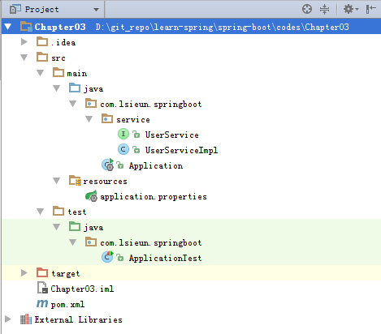

# Spring Boot中使用JdbcTemplate访问数据库 #

[Spring Boot中使用JdbcTemplate访问数据库](http://blog.didispace.com/springbootdata1/)
[Spring Boot](http://blog.didispace.com/categories/Spring-Boot/)
[程序猿DD / SpringBoot-Learning](https://gitee.com/didispace/SpringBoot-Learning)



## 1、添加数据库、数据表 ##
```sql
CREATE DATABASE `test` DEFAULT CHARACTER SET utf8 COLLATE utf8_general_ci;

USER `test`;

DROP TABLE IF EXISTS `test`;
 
CREATE TABLE `USER`(
    `name` VARCHAR(10) NOT NULL,
    `age` INT NOT NULL
);
```

## 2、pom.xml文件 ##

pom.xml

```xml
<?xml version="1.0" encoding="UTF-8"?>
<project xmlns="http://maven.apache.org/POM/4.0.0"
         xmlns:xsi="http://www.w3.org/2001/XMLSchema-instance"
         xsi:schemaLocation="http://maven.apache.org/POM/4.0.0 http://maven.apache.org/xsd/maven-4.0.0.xsd">
    <modelVersion>4.0.0</modelVersion>

    <groupId>com.lsieun.springboot</groupId>
    <artifactId>Chapter03</artifactId>
    <version>1.0-SNAPSHOT</version>
    <packaging>jar</packaging>

    <name>Chapter03</name>
    <description>Demo project for Spring Boot</description>

    <parent>
        <groupId>org.springframework.boot</groupId>
        <artifactId>spring-boot-starter-parent</artifactId>
        <version>1.4.7.RELEASE</version>
        <relativePath/> <!-- lookup parent from repository -->
    </parent>

    <properties>
        <project.build.sourceEncoding>UTF-8</project.build.sourceEncoding>
        <project.reporting.outputEncoding>UTF-8</project.reporting.outputEncoding>
        <java.version>1.8</java.version>
    </properties>

    <dependencies>
        <dependency>
            <groupId>org.springframework.boot</groupId>
            <artifactId>spring-boot-starter</artifactId>
        </dependency>

        <dependency>
            <groupId>org.springframework.boot</groupId>
            <artifactId>spring-boot-starter-test</artifactId>
            <scope>test</scope>
        </dependency>

        <dependency>
            <groupId>org.springframework.boot</groupId>
            <artifactId>spring-boot-starter-web</artifactId>
        </dependency>

        <dependency>
            <groupId>org.springframework.boot</groupId>
            <artifactId>spring-boot-starter-jdbc</artifactId>
        </dependency>

        <dependency>
            <groupId>mysql</groupId>
            <artifactId>mysql-connector-java</artifactId>
            <version>5.1.21</version>
        </dependency>
    </dependencies>

    <build>
        <plugins>
            <plugin>
                <groupId>org.springframework.boot</groupId>
                <artifactId>spring-boot-maven-plugin</artifactId>
            </plugin>
        </plugins>
    </build>

</project>
```

## 3、Application ##

Application.java

```java
package com.lsieun.springboot;

import org.springframework.boot.SpringApplication;
import org.springframework.boot.autoconfigure.SpringBootApplication;

@SpringBootApplication
public class Application {
    public static void main(String[] args) {
        SpringApplication.run(Application.class, args);
    }
}
```

## 4、application.properties ##

application.properties

```properties
spring.datasource.url=jdbc:mysql://localhost:3306/test
spring.datasource.username=root
spring.datasource.password=root
spring.datasource.driver-class-name=com.mysql.jdbc.Driver
```

## 5、实现 ##

UserService.javqa

```java
package com.lsieun.springboot.service;

public interface UserService {

    /**
     * 新增一个用户
     * @param name
     * @param age
     */
    void create(String name, Integer age);

    /**
     * 根据name删除一个用户高
     * @param name
     */
    void deleteByName(String name);

    /**
     * 获取用户总量
     */
    Integer getAllUsers();

    /**
     * 删除所有用户
     */
    void deleteAllUsers();

}
```

UserServiceImpl.java

```java
package com.lsieun.springboot.service;

import org.springframework.beans.factory.annotation.Autowired;
import org.springframework.jdbc.core.JdbcTemplate;
import org.springframework.stereotype.Service;

@Service
public class UserServiceImpl implements UserService {

    @Autowired
    private JdbcTemplate jdbcTemplate;

    @Override
    public void create(String name, Integer age) {
        jdbcTemplate.update("insert into USER(NAME, AGE) values(?, ?)", name, age);
    }

    @Override
    public void deleteByName(String name) {
        jdbcTemplate.update("delete from USER where NAME = ?", name);
    }

    @Override
    public Integer getAllUsers() {
        return jdbcTemplate.queryForObject("select count(1) from USER", Integer.class);
    }

    @Override
    public void deleteAllUsers() {
        jdbcTemplate.update("delete from USER");
    }
}
```

## 6、单元测试 ##

ApplicationTest.java

```java
package com.lsieun.springboot;

import org.junit.Assert;
import org.junit.Before;
import org.junit.Test;
import org.junit.runner.RunWith;
import org.springframework.beans.factory.annotation.Autowired;
import org.springframework.boot.test.context.SpringBootTest;
import org.springframework.test.context.junit4.SpringJUnit4ClassRunner;

import com.lsieun.springboot.service.UserService;

@RunWith(SpringJUnit4ClassRunner.class)
@SpringBootTest
public class ApplicationTest {
    @Autowired
    private UserService userSerivce;

    @Before
    public void setUp() {
        // 准备，清空user表
        userSerivce.deleteAllUsers();
    }

    @Test
    public void test() throws Exception {
        // 插入5个用户
        userSerivce.create("a", 1);
        userSerivce.create("b", 2);
        userSerivce.create("c", 3);
        userSerivce.create("d", 4);
        userSerivce.create("e", 5);

        // 查数据库，应该有5个用户
        Assert.assertEquals(5, userSerivce.getAllUsers().intValue());

        // 删除两个用户
        userSerivce.deleteByName("a");
        userSerivce.deleteByName("e");

        // 查数据库，应该有5个用户
        Assert.assertEquals(3, userSerivce.getAllUsers().intValue());

    }
}
```
