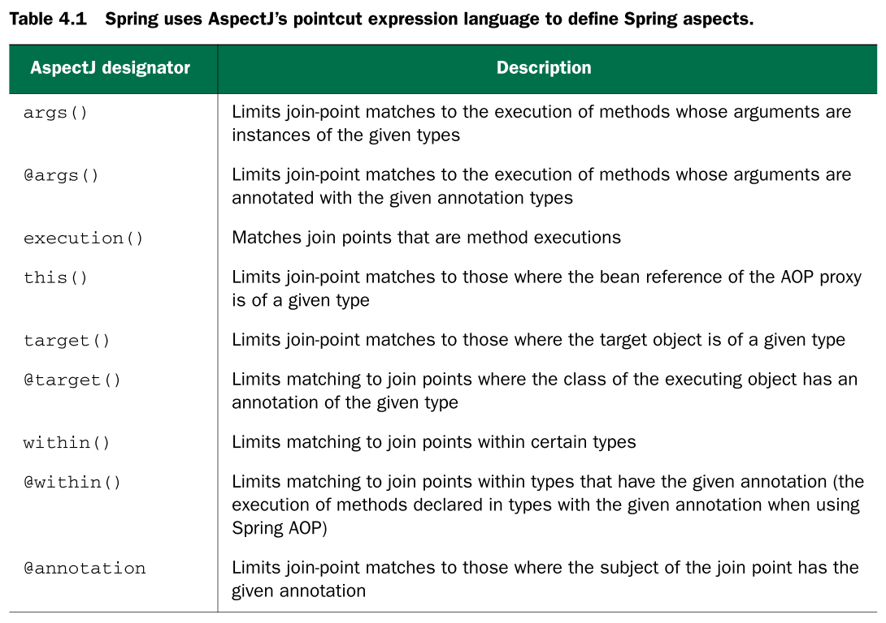
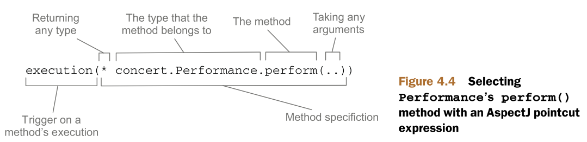
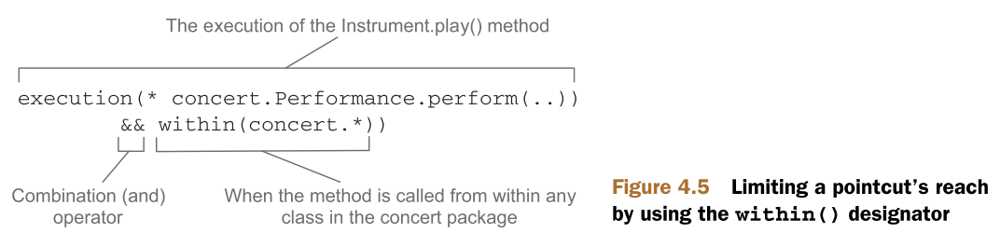

# 4. Aspect-oriented Spring #

## 4.1 What is aspect-oriented programming? ##

**Aspects** help to modularize **cross-cutting concerns**. In short, **a cross-cutting concern** can be described as any functionality that affects multiple points of an application.

> 由cross-cutting concerns引出了Aspects

**Cross-cutting concerns** can now be modularized into special classes called **aspects**. This has **two benefits**. **First**, the logic for each concern is in one place, as opposed to being scattered all over the code base. **Second**, your service modules are cleaner because they only contain code for their primary concern (or core functionality), and secondary concerns have been moved to aspects.

> cross-cutting concerns可以modularize成一种特殊的类，称之为aspects。aspects有两个优点。

接下来问题就是：AOP涉及到“概念域”中都有哪些概念？

### 4.1.1 Defining AOP terminology ###

**Aspects** are often described in terms of **advice**, **pointcuts**, and **join points**.

> Aspects由advice、pointcuts和join points等概念来描述。

#### ADVICE ####

In AOP terms, **the job of an aspect** is called **advice**.

> advice是apects的“行为”或者是“要做什么”

**Advice** defines both the ***what*** and the ***when*** of an aspect. In addition to **describing the job that an aspect will perform**, **advice** addresses **the question of when** to perform the job.

> advice定义了aspect的what和when

Spring aspects can work with **five kinds of advice**:

- **Before** -The advice functionality takes place before the advised method is invoked.
- **After** -The advice functionality takes place after the advised method completes, regardless of the outcome.
- **After-returning** -The advice functionality takes place after the advised method successfully completes.
- **After-throwing** -The advice functionality takes place after the advised method throws an exception.
- **Around** -The advice wraps the advised method, providing some functionality before and after the advised method is invoked.

> Spring提供了五种类型的advice

#### JOIN POINTS ####

A **join point** is a point in the execution of the application where an aspect can be plugged in.

> joint point就是aspect可以plugged in的地方

#### POINTCUTS ####

If **advice** defines the **what** and **when** of aspects, the **pointcuts** define the **where**. A pointcut definition matches one or more join points at which advice should be woven.

> advice确定了aspect的what和when，而pointcuts确定了aspect的where。

#### ASPECTS ####

An **aspect** is the merger of **advice** and **pointcuts**. Taken together, **advice** and **pointcuts** define everything there is to know about an aspect -- what it does and where and when it does it.

> aspect由advice和pointcuts组合而成。

#### INTRODUCTIONS ####

In **introduction** allows you to add new methods or attributes to existing classes.

> introduction是为existing classes添加new methods or attributes

#### WEAVING ####

**Weaving** is the process of applying aspects to target object to create a new proxied object. The aspects are woven into the target object at the specified join points.


**总结**

	aspect = advice + pointcuts
	aspect ---> join point <--- target object
	aspect + target object ---> weaving --> a new proxied object

在这一节里，讲述了AOP涉及到的几个概念：advice、join point、pointcuts、aspect、introduction和weaving。 下面将结合Spring，来讲述Spring的AOP。

### 4.1.2 Spring's AOP support ###

Spring's support for AOP comes in **four styles**:

- Classic Spring proxy-based AOP
- Pure-POJO aspects
- @AspectJ annotation-driven aspects
- Injected AspectJ aspects(available in all version of Spring)

> Spring支持4种类型的AOP

The **first three style** are all variations on Spring's own AOP implementation. **Spring AOP is built around dynamic proxies**. Consequently, **Spring's AOP support is limited to method interception**.

> Spring的AOP是基于dynamic proxies实现的，因此Spring的AOP只能用于method interception。

When held up against simple **declarative AOP** and **annotation-based AOP**, **Spring's classic AOP** seems bulky and overcomplicated. Therefore, I won't be covering classic Spring AOP.

> 第一种情况：Spring's classic AOP。 Spring的classic AOP过于笨重，因此不会涉及到细节。

With Spring's **aop namespace**, you can turn **pure POJOs** into **aspects**. In truth, those POJOs will only supply methods that are called in reaction to a pointcut. Unfortunately, this technique requires **XML configuration**, but it's an easy way to declaratively turn any object into an aspect.

> 第二种情况：Spring's XML AOP。 

Spring borrows AspectJ's aspects to enable annotation-driven AOP. Under the covers, it’s still **Spring’s proxy-based AOP**, but the programming model is almost identical to writing full-blown AspectJ annotated aspects. The perk(额外津贴) of this AOP style is that **it can be done without any XML configuration**.

> 第三种情况：Spring's annotation-driven AOP。 

If your AOP needs exceed simple method interception (constructor or property interception, for example), you’ll want to consider implementing aspects in AspectJ. In that case, **the fourth style** listed will enable you to inject values into AspectJ-driven aspects.

> 第四种情况：AspectJ-driven aspects。 

Before we get started, it's important to understand a few key points of Spring's AOP framework.

- SPRING ADVICE IS WRITTEN IN JAVA
- SPRING ADVISES OBJECTS AT RUNTIME
- SPRING ONLY SUPPORTS METHOD JOIN POINTS


## 4.2 Selecting join points with pointcuts ##

As mentioned before, **pointcuts** are used to pinpoint **where an aspect’s advice should be applied**. Along with **an aspect's advice**, **pointcuts** are among the most fundamental elements of an aspect. Therefore, it's important to know **how to write pointcuts**.

> 如何写pointcuts很重要

The most important thing to know about AspectJ pointcuts as they pertain to Spring AOP is that **Spring only supports a subset of the pointcut designators available in AspectJ**. **Recall that Spring AOP is proxy-based, and certain pointcut expressions aren't relevant to proxy-based AOP**.  Table 4.1 lists the AspectJ pointcut designators that are supported in Spring AOP. 

> Spring支持的pointcut designators是AspectJ的一个子集



Attempting to use any of AspectJ's other designators will result in  an `IllegalArgumentException` being thrown. 

> 使用Spring不支持的pointcut designators会抛出异常

As you browse through the supported designators, note that the `execution` designator is the only one that actually performs matches. **The other designators** are used to limit those matches. This means `execution` is **the primary designator** you'll use in every pointcut definition you write. You’ll use the **other designators** to constrain the pointcut's reach.

> execution designator是最主要的(primary) designator，其他的designator用来约束pointcut's reach。

### 4.2.1 Writing pointcuts ###

Figure 4.4 shows a pointcut expression that can be used to apply advice whenever the `perform()` method is executed.



You use the `execution()` designator to select **Performance**'s `perform()` method. The method specification starts with an **asterisk**, which indicates that **you don't care what type the method returns**. Then you specify the fully qualified class name and the name of the method you want to select. For the method's parameter list, you use the **double dot (..)**, indicating that the pointcut should select any `perform()` method, no matter what the argument list is.

> 注意：return type(*)和parameter list(..)的写法

Now let's suppose that you want to confine the reach of that pointcut to only the `concert` package. In that case, you can limit the match by tacking on a `within()` designator, as shown in figure 4.5.

> 注意 within()的用法



Note that you use the **&&** operator to combine the `execution()` and `within()` designators in an "and" relationship (where both designators must match for the pointcut to match). Similarly, you could use the **||** operator to indicate an "or" relationship. And the **!** operator can be used to negate the effect of a designator.

> pointcut应用 and/or/not关系

Because **ampersands(&)** have special meaning in XML, you’re free to use and in place of **&&** when specifying pointcuts in a **Spring XML-based configuration**. Likewise, **or** and **not** can be used in place of **||** and **!**, respectively. 

> 在XML configuration中，pointcut应用 and/or/not关系

### 4.2.2 Selecting beans in pointcuts ###

In addition to the designators listed in table 4.1, Spring adds a `bean()` designator that lets you identify beans by their ID in a pointcut expression. `bean()` takes **a bean ID or name** as an argument and limits the pointcut’s effect to that specific bean.

> Spring添加了bean() designator

For example, consider the following pointcut:

```text
execution(* concert.Performance.perform()) and bean('woodstock')
```

Here you're saying that you want to apply aspect advice to the execution of **Performance**'s `perform()` method, but limited to the bean whose ID is *woodstock*.

> bean()的“正规”用法

Narrowing a pointcut to a specific bean may be valuable in some cases, but you can also use **negation** to apply an aspect to all beans that don't have a specific ID:

> bean()的negation用法

```text
execution(* concert.Performance.perform()) and !bean('woodstock')
```

In this case, the aspect's advice will be woven into all beans whose ID isn’t *woodstock*.

## 4.3 Creating annotated aspects ##


